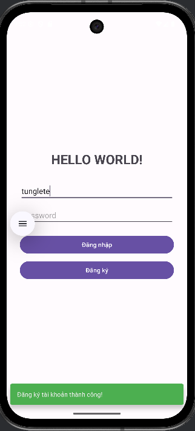
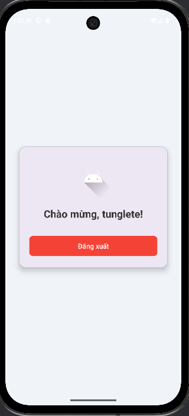

# Ứng dụng Đăng nhập / Đăng ký Đơn giản 

Đây là một dự án ứng dụng Android cơ bản được xây dựng bằng Kotlin, minh họa các chức năng cốt lõi bao gồm đăng nhập, đăng ký và quản lý phiên người dùng đơn giản.

## Tính năng chính

- **Giao diện người dùng đơn giản:** Giao diện được thiết kế gọn gàng, tập trung vào trải nghiệm người dùng.
- **Đăng ký tài khoản:** Người dùng có thể tạo tài khoản mới. Ứng dụng sẽ kiểm tra xem tên người dùng đã tồn tại trong cơ sở dữ liệu hay chưa.
- **Đăng nhập:** Người dùng sử dụng tài khoản đã đăng ký để đăng nhập.
    - Hệ thống có thể phân biệt được **Tài khoản không tồn tại** và **Sai mật khẩu**.
    - Gợi ý người dùng đăng ký nếu tài khoản chưa tồn tại.
- **Trang thông tin cá nhân:** Sau khi đăng nhập thành công, người dùng sẽ được chuyển đến màn hình chào mừng, hiển thị tên tài khoản.
- **Đăng xuất:** Người dùng có thể đăng xuất để quay về màn hình đăng nhập ban đầu một cách an toàn.
- **Thông báo hiện đại:** Sử dụng `Snackbar` thay cho `Toast` để hiển thị các thông báo (thành công, lỗi, cảnh báo) với màu sắc và nút hành động trực quan.
- **Lưu trữ dữ liệu:** Sử dụng `SQLite` để lưu trữ thông tin người dùng một cách cục bộ trên thiết bị.

## Demo

- **Đăng ký tài khoản:** Nhập tên, mật khẩu và nhấn nút **Đăng ký**

- **Đăng nhập:** Nhập tên, mật khẩu và nhấn nút **Đăng nhập**
- **Đăng xuất**: Sau khi đăng nhập thành công, nhấn nút **Đăng xuất**

